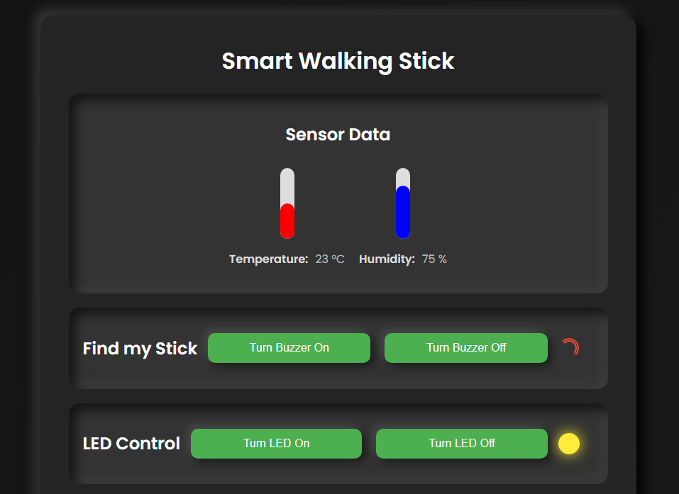
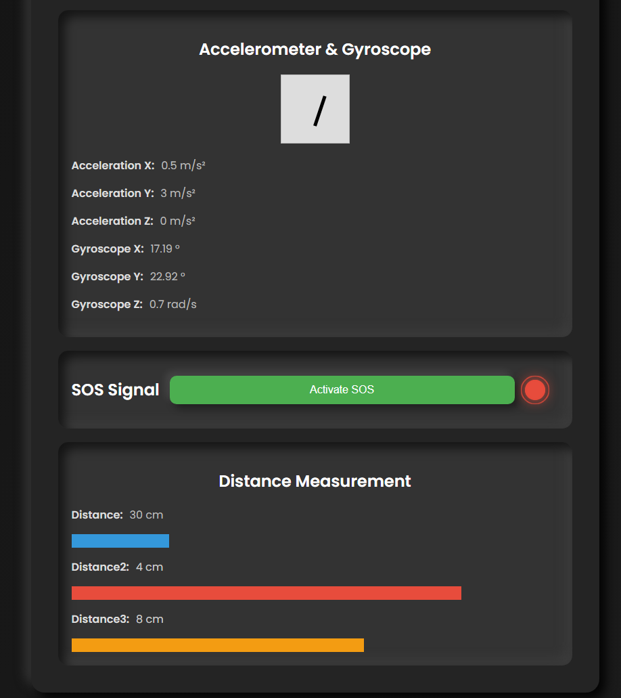

# AI Powered Smart Assistive Walking Stick for Elderly with Visual Impairments

## Project Overview

This repository contains the software implementation of the AI Powered Smart Assistive Walking Stick, designed to aid elderly individuals with visual impairments. The walking stick features advanced capabilities like fall detection, obstacle avoidance, and real-time monitoring, aimed at ensuring the safety and independence of the user.

## User Interface 



## Features

- **Fall Detection:** Utilizes accelerometer and gyroscope data, processed by a custom neural network, to accurately detect falls and send an SOS message to a connected smartphone.
- **Obstacle Avoidance:** Implements a novel 270-degree ultrasonic sensor system for comprehensive coverage, triggering vibratory motors to provide tactile feedback about the location of obstacles.
- **Real-Time Monitoring:** Enables family members or caregivers to monitor the user’s status through a connected smartphone application, providing peace of mind and timely assistance in case of emergencies.

## Tech Stack

- **Microcontroller:** ESP32
- **Programming Languages:** C++, Javascript, Node.JS, tensorflowlite
- **Neural Network:** Custom model for fall detection
- **Sensors:** Accelerometer, Gyroscope, Ultrasonic Proximity Sensors
- **Connectivity:** Bluetooth for smartphone integration, Cloud for data transmission
- **Development Environment:** Arduino IDE, TensorFlow Lite

## Hardware Components

- **ESP32 Microcontroller**
- **MPU6050 Accelerometer and Gyroscope**
- **HC-SR04 Ultrasonic Sensors**
- **Vibratory Motors**
- **SOS Button**
- **Lithium-ion Battery**
- lcd screen
- Heart Rate monitor
- Temperature and Humidity sensor

## System Architecture

The system architecture is centered around the ESP32 microcontroller, which interfaces with various sensors for movement tracking and obstacle detection. The data collected is processed in real-time to trigger appropriate actions, such as sending alerts or activating tactile feedback.

## Installation

1. **Clone the Repository:**
    ```bash
    git clone https://github.com/yourusername/smart-cane.git
    cd smart-cane
    ```
2. **Install Dependencies:**
   - Ensure you have the Arduino IDE and the required libraries (e.g., ESP32, MPU6050, TensorFlow Lite) installed.

3. **Upload the Code:**
   - Open the project in Arduino IDE and upload it to the ESP32 microcontroller.

4. **Configure Smartphone Application:**
   - Pair the device with the smartphone via Bluetooth and set up the monitoring app.

## Usage

1. Power on the smart cane and ensure it's paired with the smartphone.
2. The cane will automatically start detecting obstacles and monitoring for falls.
3. In case of a detected fall, an SOS message will be sent to the connected smartphone.
4. Family members or caregivers can monitor the real-time data through the app.

## Future Work

- **Enhanced Fall Detection:** Further refine the neural network for even higher accuracy.
- **Additional Sensors:** Integrate more sensors to improve obstacle detection.
- **Battery Optimization:** Increase battery life through power-efficient programming.


